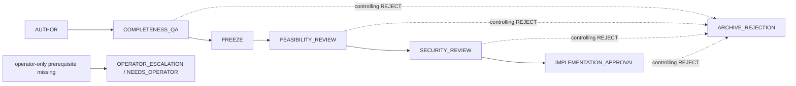

# Architecture Governance Gate Engine

## Why this exists

Hermes Agency needs a deterministic governance boundary before later runtime code can dispatch work, create Kanban cards, contact reviewers, or perform release actions. Repeated review loops, stale task summaries, self-review, and transport errors previously have no shared, typed model that separates facts from outcomes.

This PR introduces that model only. It is a pure, in-memory reducer with explicit input events and serializable state. It performs no I/O and imports no orchestration, Kanban, Keryx, pool, worktree, or release module.

## Architecture-governance graph

The normal gate order is fixed:

1. `AUTHOR`
2. `COMPLETENESS_QA`
3. `FREEZE`
4. `FEASIBILITY_REVIEW`
5. `SECURITY_REVIEW`
6. `IMPLEMENTATION_APPROVAL`

`ARCHIVE_REJECTION` and `OPERATOR_ESCALATION` are exceptional state records, not autonomous technical work.

## Operational failure is not a verdict

An operational failure—transport failure, timeout, dispatch error, unavailable worker, or malformed response—is recorded by `OPERATIONAL_FAILURE_RECORDED`. It never becomes `APPROVE` or `REJECT`.

Each start increments the gate attempt exactly once. A failure returns the gate to `READY` only while its configured attempt budget remains. At exhaustion, the gate and revision are `FAILED`, not rejected. Duplicate events do not increment attempts.

A controlling verdict is different: it must be a structured `ReviewVerdict` containing an explicit decision, reviewer identity and role, exact reviewed artifact identity, report reference, issued timestamp, and a 64-hex SHA-256 report hash. A controlling `REJECT` atomically rejects and archives that exact revision.

## Revision immutability and successor revisions

Rejected, failed, superseded, and operator-blocked revisions cannot be resumed or amended. A replacement is created only by `SUCCESSOR_REVISION_STARTED`, which supplies a new ID and creates a higher revision number. Each predecessor may have exactly one successor. The successor has a backwards `predecessor_revision_id`; the old terminal revision is deliberately not modified with a forward link.

JSON restoration requires an explicit, first, and unique `WORKFLOW_CREATED` genesis event with an exact creation-input payload. It rebuilds the initial run and fixed architecture-governance template only from that event, then replays later events and requires exact equality with the stored materialized state. Snapshot-only changes to topology, gate policy, revision identity, author ownership, or artifact hashes therefore fail closed. Event digests provide deterministic identity and idempotency checks, not storage authentication: detecting a fully rewritten unauthenticated ledger/root is out of scope until a trusted signed root or authenticated persistence layer is added.

This preserves rejection evidence even when a later architecture replaces it.

## Artifact identity binding

`ArtifactIdentity` contains logical references, hash mapping, known byte sizes, creator, and freeze state. `FREEZE` requires a complete frozen identity with hashes. Feasibility, security, and implementation-approval verdicts must match the complete frozen identity exactly. Any hash/size/reference mutation fails validation.

Cached progress, Kanban metadata, and human-readable summaries are stored only as non-authoritative observations. They cannot override a structured hashed verdict. Conflicting authoritative verdicts fail closed with a typed workflow error.

## Operator escalation

`OPERATOR_INPUT_REQUIRED` represents a decision boundary controlled only by the operator: provider accounts, credentials, publication identities, budgets, endpoints, or policy. It transitions the active revision and run to `NEEDS_OPERATOR`, records an `OperatorDecision`, and skips runnable technical gates. The engine cannot manufacture another planning, QA, freeze, feasibility, or security gate after that state.

## State, events, and invariants in this PR

The new `hermes-agency/workflow/` package supplies:

- immutable typed records for workflow runs, revisions, gates, artifact identities, verdicts, operator decisions, events, and complete state;
- strict enums for workflow/revision/gate/event/verdict categories;
- the `architecture-governance` template;
- `transition(current_state, event) -> new_state`, a pure copy-on-write reducer;
- graph validation, deterministic ready-gate calculation, and single-controlling-gate validation;
- reviewer-independence and artifact-identity validation, binding every persisted reviewer and gate author to the revision artifact's immutable creator identity;
- idempotent event ledger semantics using canonical event digests;
- canonical JSON serialize/restore with validation before use, including revalidation of persisted reviewer independence and full report fields; and
- focused regression tests, including the real-world repeated-review scenario.

Core enforced invariants include:

- at most one controlling gate may be running per revision;
- dependencies must succeed before a gate starts;
- artifact authors cannot provide QA, feasibility, security, or implementation-approval review;
- only exact frozen artifacts can receive downstream controlling verdicts;
- explicit controlling rejections terminate and archive the exact revision;
- no downstream technical gate runs after rejection;
- duplicate exact events are no-ops and reused IDs with changed content are errors;
- state status cannot be modified except through recognized events; and
- JSON restoration preserves the complete event ledger and authoritative state.

## Explicit non-goals

This PR does not:

- dispatch a worker, wake a profile, create a task, write Kanban state, or start a background loop;
- invoke Keryx, pool routing, reviewer routing, Git, worktrees, builds, release, signing, publishing, or deployment;
- modify `orch_route`, `orch_decompose`, remote task policy, or existing runtime behavior;
- introduce a database or a new runtime dependency; or
- migrate existing workflow templates in `workflows.py`.

## Follow-up PRs

Later PRs may add adapters that persist state, request a human review, dispatch a gate through the existing routing layer, project state into Kanban, or connect operator decisions. Those adapters must treat this package as the controlling source of transition legality and must retain the same frozen-identity and hashed-report contract.
